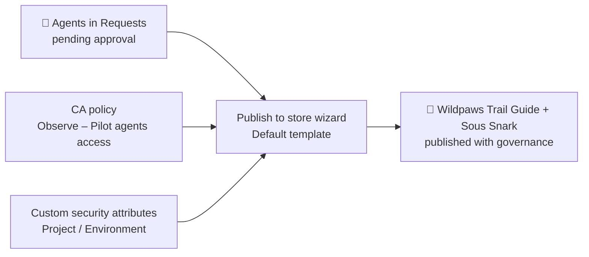

# 🛡️ Agent 365 Apply Governance When Publishing the Agents

> Apply the **Conditional Access policy** and the **custom security attributes** we created in the [Entra-set-up guide](../Entra-set-up/Conditional-Access-for-Agents.md) directly during the **Publish** wizard for the two agents (`Wildpaws Trail Guide` and `Sous Snark`) that are currently **pending approval** in **Requests**.

## What you'll build

The **Publish** wizard opens with the **Default template** and a **Security policies and protections** step where you can select **custom policies** **Conditional Access** and **Custom Security Attribute** so each agent gets governance applied at activation time.

---

## Prerequisites

- **Agent 365 license** on the tenant.
- The **two agents must be in `Requests` / pending approval** in the Microsoft 365 admin center (don't approve them yet).
- These already exist in Entra (from the Entra-set-up guide):
  - Conditional Access policy **`Observe – Pilot agents access`** (scoped to the agent identities).
  - Custom security attribute set **`AgentGovernance`** with attributes **`Project`** and **`Environment`**.

---

## Step 1 Confirm the source policies exist in Entra

The Publish wizard can only offer policies that are **already created**. Verify both:

1. **Conditional Access:** **Entra admin center → Conditional Access → Policies** → confirm **`Observe – Pilot agents access`** exists and is scoped to **Agents → the agent identities** (at least one agent identity selected, or it won't appear in the wizard picker).
2. **Custom security attributes:** **Entra admin center → Custom security attributes** → confirm the **`AgentGovernance`** set with **`Project`** and **`Environment`** attributes exists.

> If either is missing, complete the relevant step in the [Conditional Access for Agents guide](../Entra-set-up/Conditional-Access-for-Agents.md) before continuing.

---

## Step 2 Publish each pending agent and apply governance

The agents are sitting in **Requests / pending approval**. Apply the CA policy and security attributes as part of the publish wizard it opens with the **Default template** already selected.

1. In the **Microsoft 365 admin center**, go to **Agents → All agents → Requests**.
2. Select **`Wildpaws Trail Guide`** and review its details (capabilities, data sources, security & permissions, custom actions).
3. Select **Publish to store** to open the publishing wizard.
4. **Audience:** select the users or groups who can install the agent. *(Optional)* select who gets it preinstalled. Select **Next**.
5. **Security policies and protections:** the wizard opens with the **Default** policies (Microsoft built-ins, shown **locked**). Under **Custom**, select the policies to apply:
   - **Conditional Access** → select **`Observe – Pilot agents access`**.
   - **Custom Security Attribute** → select the **`AgentGovernance`** attributes and values (`Project = Agent365Pilot`, `Environment = Pilot`).
   - *(Optional)* **Access Package** skip this unless you want to govern resource access too.

   Select **Next**.
6. **Review permissions:** review the permissions the agent requests and grant admin consent if appropriate. Select **Next**.
7. Review the summary and select **Publish**.
8. **Repeat steps 2–7 for `Sous Snark`.**

> Policies apply to **new activations only**, so applying them here (while pending) is the right moment you can't add them after the agent is approved.

---

## Step 3 Verify the governance landed

1. **Custom security attributes:** **Entra admin center → Enterprise applications → [agent's `-AgentIdentity` SP] → Custom security attributes** → confirm `Project = Agent365Pilot` and `Environment = Pilot`.
2. **Conditional Access:** drive a few agent calls in Teams, then **Entra ID → Monitoring → Sign-in logs → Service principal sign-ins** → confirm the **`Observe – Pilot agents access`** policy shows up under the agent's entry (Report-only result).
3. **Activity:** prompt the agents in the **Playground** and wait a few minutes the **Activity** tab in the **Admin center** will start to populate.

---

## Reference

- [Agent templates (Microsoft Agent 365)](https://learn.microsoft.com/microsoft-agent-365/admin/agent-template)
- [Manage agent requests in Microsoft 365 admin center](https://learn.microsoft.com/microsoft-365/admin/manage/agent-requests)
- [Conditional Access for Agent ID](https://learn.microsoft.com/entra/identity/conditional-access/agent-id?tabs=custom-security-attributes)
- [What are custom security attributes in Microsoft Entra ID?](https://learn.microsoft.com/entra/fundamentals/custom-security-attributes-overview)

