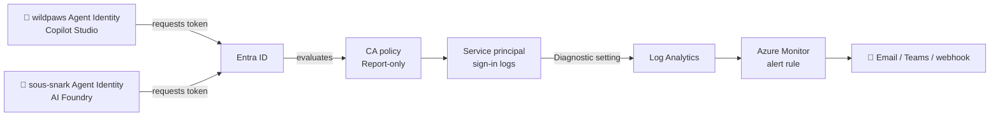
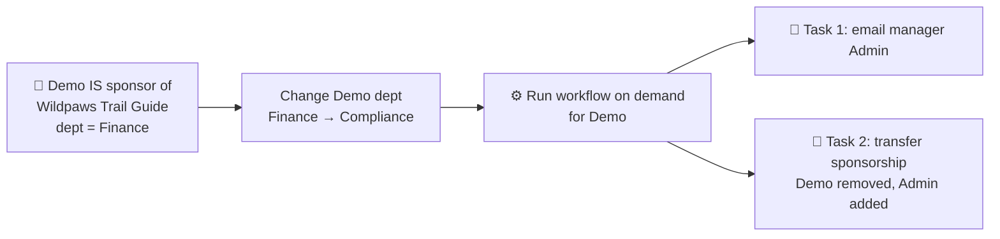

# 🔐 Conditional Access for Agents

## Index

- [What you'll build](#what-youll-build)
- [Why this matters (what participants learn)](#why-this-matters-what-participants-learn)
- [Prerequisites](#prerequisites)
- [Step 1 Create the Conditional Access policy (Report-only)](#step-1--create-the-conditional-access-policy-report-only)
- [Step 2 Tag the agents with custom security attributes](#step-2--tag-the-agents-with-custom-security-attributes)
- [Step 3 Notify the sponsor's manager when sponsorship changes](#step-3--notify-the-sponsors-manager-when-sponsorship-changes)

---

## What you'll build



---

## Why this matters (what participants learn)

> This pilot includes **two agents**: **wildpaws** (the Copilot Studio travel concierge) and **Sous Snark** (the AI Foundry hosted agent). The policy below targets **both** so you observe every agent created in this pilot, not just one.

- **Agents have their own identity.** Neither wildpaws nor Sous Snark is a user each is an Entra *agent identity* derived from a *blueprint*. Conditional Access can target them directly.
- **CA applies to agents, not just people.** The same policy engine that gates employee sign-ins now gates AI agents.
- **Report-only = safe observation.** Watch the agent's behavior without breaking it, then promote to enforcement.
- **The token-request → sign-in-log → Log Analytics → alert pipeline** is the real-world way to monitor what an autonomous agent is doing.
- **Block is the only control for agent identities** there's no MFA/interactive remediation for a non-human, which is why agent governance differs from user governance.

---

## Prerequisites

---

## Step 1 Create the Conditional Access policy (Report-only)

1. Sign in to the **Microsoft Entra admin center** (`https://entra.microsoft.com`) → **Entra ID → Conditional Access → Policies → New policy**.
2. Name it: `Observe – Pilot agents access`.
3. **Assignments → Users, agents or workload identities → What does this policy apply to? → Agents**:
   - **Select agent identities** → pick **both pilot agents**: **wildpaws** and **sous-snark** (the `-AgentIdentity` SPs).
   - *Optional:* select the **agent blueprint principal(s)** instead to automatically cover every agent derived from those blueprints, including future ones.
4. **Target resources → Include → Select resources** → pick the resources the pilot agents actually call (e.g. **Microsoft Graph** and any Foundry/Power Platform APIs the two agents use). This scopes the policy to just the pilot's surface area rather than every resource in the tenant.
5. *(Optional)* **Conditions → Agent risk (Preview) → Configure = Yes** → choose `High` (and `Medium`) to fire only on risky-agent signals.
6. **Access controls → Grant → Block** for agent identities, **Block is the only control** (no interactive remediation exists).
7. **Enable policy = Report-only** → **Create**.

> Report-only means the agent keeps working, but every token request is evaluated and logged as "would have been blocked/granted" exactly the observability we want. Once you've confirmed the logs look right, flip the toggle to **On** to actually enforce.

---

## Step 2 Tag the agents with custom security attributes

> **Note:** managing custom security attributes requires the **Attribute Definition Administrator** and **Attribute Assignment Administrator** roles (separate from CA admin, by design).

**Custom security attributes** are tenant-defined key/value pairs you can stamp onto each agent identity. They make the two pilot agents easy to find, filter in logs, and target dynamically in Conditional Access (so future agents tagged the same way are automatically covered).

**a. Create an attribute set** (one-time): **Entra ID → Custom security attributes → Add attribute set** → name it `AgentGovernance`.

**b. Define attributes** inside that set (**Add attribute** for each):

| Attribute | Type | Allowed values | Why it's useful |
|-----------|------|----------------|-----------------|
| `Project` | String (predefined) | `Agent365Pilot` | Groups everything in this pilot; one filter pulls both agents. |
| `Environment` | String (predefined) | `Pilot`, `Prod` | Prevents pilot agents from being mistaken for production. |

**c. Assign values to each agent:** **Entra ID → Enterprise applications → [agent's `-AgentIdentity` SP] → Custom security attributes → Add assignment**:

| Attribute | wildpaws (Copilot Studio) | sous-snark (AI Foundry) |
|-----------|---------------------------|--------------------------|
| `Project` | `Agent365Pilot` | `Agent365Pilot` |
| `Environment` | `Pilot` | `Pilot` |

---

## Step 3 Notify the sponsor's manager when sponsorship changes

Every agent identity has a **sponsor** the human accountable for it. When that sponsor **leaves or changes role**, the agent needs a new owner. Microsoft Entra ID Governance **Lifecycle Workflows** automate this: a built-in task emails the sponsor's **manager**, and a companion task can **reassign the sponsorship to that manager automatically**.



### 3a. Assign a sponsor to the agent and set a starting department

> For this pilot we trigger the workflow **only for the `Wildpaws Trail Guide` agent**, so you only need to sponsor that one.

1. **Create a demo user.** **Entra ID → Users → + New user → Create new user** name it **Demo** and create it. Then open **Demo → Edit properties → Job info** and set **Manager = your Admin account** and **Department = `Finance`** → **Save**.
2. **Entra ID → Agents → Agent Identities → [`Wildpaws Trail Guide`] → Owners/Sponsors** (agent identities expose a **Sponsors** relationship).
3. Add the test user **Demo** as the **sponsor** of **Wildpaws Trail Guide**. Remove your Admin user as sponsor there should now be only one account as sponsor/owner: **Demo**.
4. Set Demo's starting department to **Finance**: **Entra ID → Users → Demo → Edit properties → Job info → Department = `Finance`** → **Save**.
5. Confirm **Demo → Manager = Admin** (same **Job info** blade) and that **Admin** has a **mail** value the email goes to the manager.

### 3b. Build the Lifecycle Workflow from the agent-sponsor template

1. **Entra ID → ID Governance → Lifecycle Workflows → Workflows → + New workflow**.
2. Select the template **"Agent sponsor job profile change"** (tagged **Mover** / **Agents** *"Execute sponsorship transition tasks for agent sponsor job changes"*).
3. **Basics:** name it `Notify manager – agent sponsorship change` → **Next**.
4. **Configure scope (execution conditions):** under **Scope details**, **Scope type = Rule based**. Click **+ Add expression** and build the rule to match the **new** department value you'll change *to*:
   - **Property** = `department`
   - **Operator** = `equal`
   - **Value** = `Compliance`

   This produces the rule syntax:
   ```
   (department -eq "Compliance")
   ```
   *(Match the value you change **to**, not Finance the user comes "into scope" once the change lands.)* → **Next**.
5. **Review tasks:** the template pre-loads the agent sponsorship tasks. Confirm both are present (add via **+ Add task** if needed):
   1. **Send email to manager about sponsorship changes** → emails Admin. *(Optional: customize subject/body with tokens like `{{userDisplayName}}`, `{{managerDisplayName}}`.)*
   2. **Transfer agent identity sponsorships to manager** → **automatically removes Demo and makes Admin the sponsor**.
6. **Review + create.**

### 3c. Change the department, then run the workflow on demand

For the pilot we drive the run manually after staging the attribute change:

1. **Stage the role change:** **Entra ID → Users → Demo → Edit properties → Job info → Department = `Compliance`** → **Save**. Demo now matches the workflow's `(department -eq "Compliance")` scope.
2. **Run on demand:** open the workflow → **Run on demand → Select users → Demo → Run workflow**.
3. Within a couple of minutes the tasks execute against Demo.

### 3d. Verify

1. **Workflow → Workflow history → Tasks** → both tasks show **Successful**.
2. **wildpaws → Sponsors**: open the **Wildpaws Trail Guide** agent identity Demo is gone and **Admin** is now the sponsor.
