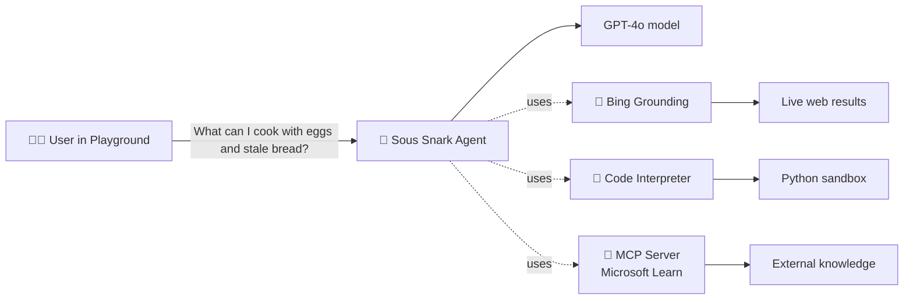

# 🍽️ Azure AI Foundry Walkthrough

> A hands-on tutorial for participants. You'll build **Sous Snark**, a passive-aggressive sous-chef agent in **Microsoft Foundry**, equipped with three capabilities:
>
> 1. **Bing grounding** live web search for recipes & nutrition facts
> 2. **Code Interpreter** runs Python to do math (calorie totals, unit conversions, etc.)
> 3. **MCP server** connects to a public **Model Context Protocol** server for live external knowledge
>
> By the end you'll have a working agent you can chat with in the Foundry Playground.

---

## 📑 Index

- [What you'll build](#️-what-youll-build)
- [Step 1 Create the Foundry resource from the Azure Portal](#step-1-create-the-foundry-resource-from-the-azure-portal)
- [Step 2 Deploy a model](#step-2-deploy-a-model)
- [Step 3 Create the Sous Snark agent](#step-3-create-the-sous-snark-agent)
- [Step 4 Add Bing grounding (web search)](#step-4-add-bing-grounding-web-search)
- [Step 5 Add Code Interpreter](#step-5-add-code-interpreter)
- [Step 6 Add an MCP server tool](#step-6-add-an-mcp-server-tool-)
- [Optional Step 7 Run an evaluation against the agent](#optional-step-7-run-an-evaluation-against-the-agent)
- [Optional Step 8 Run a Red Teaming scan against the agent](#optional-step-8-run-a-red-teaming-scan-against-the-agent)
- [Step 9 Publish Sous Snark to Agent 365](#step-9-publish-sous-snark-to-agent-365)
- [Appendix Demo prompts (one per tool)](#appendix-demo-prompts-one-per-tool)

---

## ️ What you'll build



---

## Step 1 Create the Foundry resource from the Azure Portal

We'll provision from **portal.azure.com** so participants see the Azure resource model first, then hop into the Foundry portal for project work.

1. Open **https://portal.azure.com** and sign in.
2. In the global search bar type **Microsoft Foundry** → click the **Microsoft Foundry** service.
3. Top toolbar → **+ Create**.
4. Fill in the **Create a Microsoft Foundry resource** wizard:
   - **Subscription**: your subscription
   - **Resource group**: *Create new* → `sous-snark-rg`
   - **Region**: **East US 2** *(validated for Agents + GPT-4o in this guide)*
   - **Name**: `sous-snark-fdy`
   - **Pricing tier**: **Standard S0** (default)
   - **Project name** (if the wizard asks): `sous-snark-proj`
5. Leave **Networking / Identity / Tags** at defaults.
6. **Review + create** → wait for validation → **Create**. Deployment takes ~2 minutes.
7. When deployment finishes, click **Go to resource**.
8. On the resource page → left rail → **Access control (IAM)** → **+ Add** → **Add role assignment**. On the **Role** tab search for **Azure AI Administrator** and select it. On the **Members** tab choose **User, group, or service principal**, click **+ Select members**, find your own account, select it, then **Review + assign**. This grants your account the permissions needed to create and manage agents.
9. Register the Bot Service resource provider: in the global search bar type **Subscriptions** → open your subscription → left rail → **Settings** → **Resource providers**. Search for **Microsoft.BotService**, select it, and click **Register** (status changes to *Registering* → *Registered*).
10. Click **Go to Foundry portal** (top toolbar or the blue button on the right). This opens **ai.azure.com** already scoped to your new resource and default project.

> 🛑 **Important portal default you should understand**
>
> After deployment, open the resource → **Resource Management** → **Properties**:
>
> - **Send logs to Microsoft Agent 365: Enabled** Agent traces from this resource will be forwarded to the **Microsoft Agent 365** governance plane. The banner notes "Agent 365 logging data may be stored and processed outside the Azure region of this resource."

---

## Step 2 Deploy a model

Sous Snark needs a brain. We'll use GPT-4o.

> 🟣 **Required: turn on "New Foundry"** at the top of the Foundry portal there is a **New Foundry** toggle next to the search bar. Flip it **ON**. This tutorial uses the new top navigation (**Home / Discover / Build / Operate / Docs**).

1. Top nav → **Discover** → left rail → **Models**.
2. Search for **`gpt-4o`** → click the model card to open its detail page.
3. Top-right → **Deploy ▾** → choose **Default settings** *(this auto-picks **Global Standard** SKU + default quota exactly what we want.)*
4. A **Select a project to deploy gpt-4o** dialog appears:
   - **Available regions**: choose **East US**
   - **Project**: select `proj-default`
   - Click **Continue**.
5. There is **no extra confirmation dialog** Foundry provisions the deployment and drops you straight into the **Model Playground** (top nav switches to **Build** → **Models** → **gpt-4o** → **Playground** tab). The deployment is named `gpt-4o` by default.
6. Verify in the playground header you see **Model: gpt-4o**. *(For a fuller list of deployments visit top nav → **Operate** → **Models + endpoints** `gpt-4o` should be **Succeeded**.)*

---

## Step 3 Create the Sous Snark agent

1. Top nav → **Build** → left rail → **Agents** → **+ New agent**.
2. The **Create an agent** dialog appears:
   - **Agent name**: `sous-snark`
3. Click **Create and open playground**. Foundry creates the agent and drops you into the agent designer + playground.
4. In the agent designer panel set:
   - **Deployment / Model**: select the `gpt-4o` deployment from Step 2
   - **Instructions**: open [`assets/system-prompt.md`](assets/system-prompt.md), copy the full contents, paste into the **Instructions** box
   - **Description** *(optional)*: `A passive-aggressive sous-chef agent for the bootcamp`
5. Leave **Tools / Knowledge / Memory / Guardrails** empty for now we'll add tools in Steps 4–6. *(If you see a **Web search** row already in Tools, click its **⋮** → **Remove**.)*
6. **Click Save** (top-right). The agent is **versioned**: you'll see a version label like `Version 1 (Today 3:07 PM)` in the header. The playground always runs the **last saved version**, so save before every test.
7. In the right-hand playground panel ask `"Hello, who are you?"` → confirm the response is in Sous Snark's voice (snarky, judgmental, food-themed). If it's bland, double-check the Instructions were pasted in full.
8. Your agent is now registered in **Entra Admin Center**. Go to **Agents**, locate the identity, and verify that you are the owner and that a blueprint is already associated with it.

---

## Step 4 Add Bing grounding (web search)

Gives Sous Snark live web access so it can fetch real recipes & nutrition data.

### 4a. Create a Grounding with Bing Search resource (one-time, ~3 min)

1. In a **new browser tab** open **https://portal.azure.com**.
2. Top search bar → type **Grounding with Bing Search** → click the service.
3. Click **+ Create**.
4. Fill in:
   - **Subscription**: same as the Foundry resource
   - **Resource group**: `sous-snark-rg`
   - **Name**: `sous-snark-bing`
   - **Region**: **Global** *(fixed Bing grounding is a global service)*
   - **Pricing tier**: **Grounding with Bing Search ($14 per 1K transactions)** the only option currently available *(Microsoft removed the legacy G1 free tier; there is no free tier any more)*
5. **Review + create** → check the terms boxes → **Create**. Deployment takes ~1 min.
6. **Go to resource** so the tab stays open. You don't need to copy anything from it Foundry's connection picker just needs the resource to exist in your subscription.

### 4b. Add the Bing resource as a project connection

Foundry agents call Bing through a **project-scoped connection**, not directly from the toggle. You have to register the connection once, then the agent's Web search toggle can use it.

1. In the Foundry portal top nav → **Operate** → left rail → **Admin** → click your project (e.g. `sous-snark-proj`) → **Connected resources** tab.
2. Click **Add connection** (top-right).
3. In the picker:
   - **Category / type**: **Grounding with Bing Search**
   - **Resource**: pick `sous-snark-bing` from your subscription
   - **Auth method**: **API Key** (auto-populated from the resource)
   - **Connection name**: rename to something readable like `sous-snark-bing-conn` *(Foundry suggests a cryptic auto-name like `soussnarkrg95fmda` overwrite it)*
4. Click **Add** / **Create**. The connection now appears in the **Connected resources** list with category `GroundingWithBingSearch`.

### 4c. Wire it to the agent

1. Top nav → **Build** → **Agents** → `sous-snark` → **Playground** tab.
2. In the **Tools** panel click **Add** → a **Most popular** flyout appears with toggle switches.
3. Flip **Web search** to **ON** (purple).
   - With **one** Bing connection on the project, Foundry uses it silently.
   - With **multiple** connections, a picker appears pick `sous-snark-bing-conn`.
4. A **Web search** row appears in the Tools list with an ⓘ icon (shows the cost / data-boundary warning).
5. Click **Save** (top-right) to commit a new agent version.

### 4d. Smoke test

In the playground ask:

> `Find me a real recipe for shakshuka.`

Expected: the response cites real sources (links/snippets), and clicking the **🛠 tool-call row** in the response confirms `web_search` (or similar) was invoked. Sous Snark still closes with the **🍳 Judgment Summary**.

---

## Step 5 Add Code Interpreter

Lets Sous Snark run Python for math (recipe scaling, calorie totals, unit conversions). No Azure resource needed it's a built-in sandbox managed by Foundry.

1. Top nav → **Build** → **Agents** → `sous-snark` → **Playground** tab.
2. **Tools** panel → **Add** → **Most popular** flyout.
3. Flip **Code interpreter** to **ON** (purple). No connection or config needed.
4. A **Code interpreter** row appears in the Tools list.
5. Click **Save** (top-right) to commit a new agent version.

### Smoke test

In the playground ask:

> `Scale this brownie recipe from 8 servings to 5: 200g butter, 300g sugar, 4 eggs, 80g cocoa.`

**What you should see in the response (top to bottom):**

1. **A Python code block** the agent wrote on the fly something like:
   ```python
   butter, sugar, eggs, cocoa = 200, 300, 4, 80
   scaling_factor = 5 / 8
   scaled_butter = butter * scaling_factor
   scaled_sugar  = sugar  * scaling_factor
   scaled_eggs   = eggs   * scaling_factor
   scaled_cocoa  = cocoa  * scaling_factor
   scaled_butter, scaled_sugar, scaled_eggs, scaled_cocoa
   ```
2. **An `Output` block** showing the tuple the sandbox returned, e.g. `(125.0, 187.5, 2.5, 50.0)`.
3. **A human-friendly ingredient list** in markdown bullets (Butter: 125 g, Sugar: 187.5 g, Eggs: 2.5, Cocoa: 50 g).
4. **A snarky closing line** plus the **🍳 Judgment Summary** block (Effort / Health Score / Chef Commentary).
5. **A `Code interpreter` chip** in the message footer alongside `gpt-4o`, latency, token count proof the tool was actually called (not the model just guessing).

> 💡 **Why this matters** the chip and the visible Python prove the agent **delegated** the math to a real Python sandbox. Without Code Interpreter the model would estimate the numbers itself, which is fine for `5/8` but unreliable for anything harder (irrational ratios, nutrition calculations, unit conversions across systems). The point of the tool is **accuracy over fluency**.

> 💡 **If the model doesn't call the tool** for a simple prompt, it's "cheating" doing the math in its head because it's easy enough. To force a tool call, give it a harder problem: `Use python to compute total calories: 2.5 eggs (78 kcal each), 60g butter (7.2 kcal/g), 40g sugar (3.87 kcal/g).`

> 💡 **Inspect the trace** click the **Traces** tab (top of the agent page) and open the conversation. You'll see the span tree: `invoke_agent` → `code_interpreter` (with input code + output) → `chat completion`. This is what you'd use in production to debug "why did the agent skip the tool?".

---

## Step 6 Add an MCP server tool 🔌

The **Model Context Protocol (MCP)** is an open standard for plugging external tools and knowledge sources into agents. Foundry can call any remote MCP server as a tool no SDK code, no Functions, no hosting on your side.

We'll connect the public **Microsoft Learn MCP server** zero auth, instantly available, lets the agent search and fetch official Microsoft documentation. (In a real cooking app you'd swap this for a recipe-API MCP server; the wiring is identical.)

### 6a. Open the Custom tools dialog

1. Top nav → **Build** → **Agents** → click **`sous-snark`** → **Playground** tab.
2. **Tools** panel → **Add**.
3. The "Select a tool" dialog opens with three tabs: **Configured / Catalog / Custom**. Click **Custom**.
4. You'll see three cards: **OpenAPI tool**, **Model Context Protocol (MCP)**, **Agent2agent (A2A)**. Click **Model Context Protocol (MCP)** → bottom-right **Create** lights up → click it.

### 6b. Configure the MCP connection

The "Add Model Context Protocol tool" form has only **three fields**:

| Field | Value |
|---|---|
| **Name** | `microsoft-learn` |
| **Remote MCP Server endpoint** | `https://learn.microsoft.com/api/mcp` |
| **Authentication** | **Unauthenticated** |

Click **Connect**. Foundry calls the MCP server's `list_tools` and (on success) drops you back in the playground with a new **`microsoft-learn`** row in the Tools list.

Then **Save** (top-right) to commit a new agent version.

### 6c. Smoke test

In the playground ask:

> `Find Microsoft Learn docs about the Azure OpenAI Assistants API and summarize the top 2 hits.`

**What you'll see, in order:**

1. **An `mcp_list_tools` row** Foundry fetches the server's tool catalog (this is what the ~2000-token charge is: the catalog JSON gets stuffed into the model's context). Happens automatically the first time.
2. **An `mcp_approval_request` card** with a **Context** block showing the literal call the model wants to make, e.g.:
   ```
   microsoft_docs_search({
     "query": "Azure OpenAI Assistants API"
   })
   ```
   …and **Approve / Deny** buttons. Click **Approve**.
3. **The actual response** 2 real doc titles with `learn.microsoft.com/...` URLs, summaries, and the usual snarky **🍳 Judgment Summary** at the end (Sous Snark will probably mock you for asking about API docs instead of cooking).
4. **Footer chips** showing `gpt-4o`, latency, token count, `microsoft-learn`, `microsoft_docs_search` proof of which tool was actually invoked.

> 💡 **First call is slow (~5–10s).** Foundry opens a connection to the remote MCP server, fetches the catalog, then waits for your approval. Subsequent approvals in the same conversation reuse the connection and are much faster.

> 💡 **Inspect the trace.** Open the **Traces** tab → click the conversation. You'll see a span like `mcp_tool.microsoft_docs_search` with the JSON arguments the model passed and the raw JSON the server returned. This is how you debug "why didn't the agent call my MCP server?" in production.

---

## Optional Step 7 Run an evaluation against the agent

Now that the agent is configured, run a quick quality evaluation from the Foundry **Evaluations** page.

### 7a. Open the Evaluations page

1. In Foundry, make sure you are in project **`sous-snark-proj`**.
2. Left rail → **Evaluations**.
3. Confirm the **Evaluations** tab is selected (the page may show **No evaluations found** on first run).
4. Click **Create** (top-right).

### 7b. Upload the two evaluation datasets in this project

Use the two files shipped with this tutorial:

- [`assets/evaluations/model-eval-dataset.jsonl`](assets/evaluations/model-eval-dataset.jsonl) prompts for model-only quality checks
- [`assets/evaluations/agent-eval-dataset.jsonl`](assets/evaluations/agent-eval-dataset.jsonl) prompts that exercise tool-using agent behavior

In Foundry's **Data** step:

1. Keep **Existing dataset** selected.
2. Click **Upload new dataset**.
3. In the upload dialog, **enter a New dataset name** (required):
   - For `model-eval-dataset.jsonl`, use `Model-eval`
   - For `agent-eval-dataset.jsonl`, use `Agent-eval`
4. Upload one file at a time (repeat for both files so both appear in your dataset list).
5. Continue once both datasets are visible.

### 7c. Run evaluation A (Model)

1. Click **Create** to start a new evaluation.
2. **Target**: choose **Model**.
3. **Model/deployment**: select your chat model deployment (use `gpt-4o-mini` if `gpt-4o` is unavailable).
4. **Data**: choose `model-eval-dataset.jsonl`.
5. Continue through **Field mapping** and **Configure models**.

### 7d. Run evaluation B (Agent)

1. Click **Create** again for a second evaluation.
2. **Target**: choose your **Sous Snark agent**.
3. **Model/deployment for evaluation**: choose your available chat model deployment.
4. **Data**: choose `agent-eval-dataset.jsonl`.
5. Continue through **Field mapping** and **Configure models**.

### 7e. Configure models (required when you see "Config required")

In the **Configure models** step, do this for the model card (for example `gpt-chat-latest`):

1. Click **Configure**.
2. Keep generation settings at defaults:
   - **Max response**: `1600`
   - **Temperature**: `0`
   - **Top P**: `1`
   - **Frequency penalty**: `0`
   - **Presence penalty**: `0`
3. In **Prompt** add:
   - **SYSTEM** message: `You are Sous Snark, a concise cooking assistant. Be accurate and practical.`
   - **USER** message (click **+ Message**): `{{item.query}}`
4. Click **Save**.
5. Confirm the card no longer shows **Config required**, then click **Next**.

### 7f. Criteria (this is the screen you are on)

1. Keep the auto-suggested evaluators for your first run.
2. If you want a lighter baseline run, keep only these:
   - **Agents**: `TaskCompletion`, `IntentResolution`
   - **Quality**: `Relevance`, `Groundedness`, `Fluency`, `Coherence`
   - **Safety**: keep defaults
3. Click **Next**.

### 7g. Review results

1. Wait until status changes from **Running** to **Completed**.
2. Open each evaluation row and review:
   - Overall score summary
   - Per-prompt outputs
   - Any low-scoring prompts or safety flags
3. Compare model-only vs agent-targeted results and capture at least one improvement action (example: tighten instructions for tool usage consistency or tool-selection behavior).

How to read the table:

- `8/8` means 8 out of 8 samples were evaluated for that metric.
- `100%` means all evaluated samples passed that specific evaluator.
- `0/0` means no samples were scored for that metric in that run (usually mapping/data/config issue, not "all failed").
- Use the horizontal scroll in the results grid to see all evaluator groups (Agents, Quality, Safety, Business).
- Start with patterns, not one metric in isolation. Example: high Safety + low TaskCompletion means answers are safe but not useful enough.

What to show in class from a completed baseline run:

1. The run status is **Completed** (pipeline succeeded end-to-end).
2. Dataset name/version and token usage (cost awareness).
3. A quick scan of evaluator categories, then one row-level example.
4. One concrete improvement action before the next run.

Tip for stronger insights:

- Run at least one additional evaluation with a different dataset (for example, agent-focused prompts), then use **Compare runs**.
- Larger and more varied datasets produce more meaningful trends than tiny "all easy" sets.

---

## Optional Step 8 Run a Red Teaming scan against the agent

After baseline evaluations, run an automated red teaming scan to test safety and security behavior.

### 8a. Open Red team

1. In Foundry, stay in project **`sous-snark-proj`**.
2. Left rail → **Evaluations**.
3. Top tabs → click **Red team**.
4. Click **Create** (top-right).

### 8b. Configure the red teaming run

> 🟡 **Note:** Red teaming through the UI is **not available in all regions** as of June 2026. If you don't see the red teaming option, your Foundry resource's region may not support it yet pick a supported region or run red teaming via the SDK instead.

1. **Target**: choose your **Sous Snark agent**.
2. **Analysis model** / judge model: keep default (`gpt-chat-latest`) unless your tenant requires a different approved deployment.
3. **Risk categories**: keep default suggested categories for first run.
4. Click **Modify risk categories**.
5. If you see **Tool information required**, fill **Tool description** for each selected tool (required for categories marked with `*`, such as Task adherence and Prohibited actions). Use short, plain-language descriptions:
   - `web_search`: `Searches public web content and returns source-backed snippets and links.`
   - `code_interpreter`: `Executes Python code for calculations and structured transformations.`
   - `mcp`: `Queries the Microsoft Learn MCP server for official documentation content.`
6. Click **Save** in the risk-category dialog.
7. **Intensity / sample size**: use default starter settings (for example, `5` seed data queries per category) for classroom speed.
8. Start the run.

> 🟡 If **Save** is disabled in the risk-category dialog, at least one selected tool is missing a description.

### 8c. Review red teaming results

1. Wait for status to move to **Completed**.
2. Open the run and review:
   - Which categories produced findings (if any)
   - Severity and example prompts
   - Suggested mitigations
3. Capture one concrete hardening action (for example: add a refusal rule, tighten system prompt boundaries, or add guardrails).

Notes:

- **ASR = Attack Success Rate.** In each risk column, the percentage shows how often attacks succeeded for that category.
- The fraction (for example `6/32`) means successful attacks / total attacks tested for that category.
- Lower ASR is better. Prioritize categories with the highest ASR first.
- Use horizontal scroll to see all risk columns (Task adherence, Prohibited actions, Sensitive data leakage, Violence, etc.).
- `0%` with a non-zero denominator (for example `0/32`) means no successful attacks were found for that category in this run.
- `0/0` means that category did not run with valid samples in that attempt (configuration/data issue), not "fully safe."
- Treat this as a risk signal, not a compliance certificate. Re-run after mitigations and compare ASR trend over time.

---

## Step 9 Publish Sous Snark to Agent 365

### 9a. Open the Publish dialog

1. In Foundry, open your **`sous-snark`** agent in the **Build** view (the screen with **Playground / Details / Traces / Monitor / Evaluation**).
2. Top-right of the agent header, click the **Publish** ▾ button → choose **Publish to Teams and Microsoft 365** *(Preview)*.
3. The **Publish to Teams and Microsoft 365** dialog opens.

### 9b. Fill in the Agent details

| Field | Value (suggested) | Notes |
|---|---|---|
| **Agent name** | `sous-snark` |  |
| **Publish version** | `3 . 0 . 0` | Anything Major than 1 |
| **Short description** | `A snarky AI sous-chef that grounds answers with web search, Python, and Microsoft Learn.` |  |
| **Description** | `Sous Snark is a passive-aggressive sous-chef agent built on Microsoft Foundry. It uses Bing grounding for live recipes and nutrition facts, Code Interpreter for calorie math and unit conversions, and the Microsoft Learn MCP server for documentation lookups. Use it when you want quick cooking answers with attitude or as a teaching sample for Foundry agents, tools, and Agent 365.` | What it does + when to use it. Surfaces in Teams app details and the Agents Registry. |
| **Azure bot services** | `sous-snark41615` *(auto-suggested)* | Foundry auto-provisions an Azure Bot resource in `sous-snark-rg`. You can pick an existing bot from the dropdown if you've published before. |

Click **Next: Publish options**, select **People in your organization**, and then click **Publish**.

### 9c. Fill in the Author block

Scroll down past the Agent block:

| Field | Value |
|---|---|
| **Developer** | Your name or team (e.g. `Wildpaws Workshops`). |
| **Website** *(under "More ▾")* | A URL you control, e.g. `https://learn.microsoft.com` for the tutorial. |
| **Privacy policy URL** | Required for publish use `https://privacy.microsoft.com/privacystatement` for the workshop or your own. |
| **Terms of use URL** | Required use `https://www.microsoft.com/legal/terms-of-use` for the workshop. |

> 💡 The **Privacy** and **Terms** URLs are validated by the M365 manifest schema. Empty values block the next step.

### 9d. Grant the agent permission to write to Agent 365 (OtelWrite) 🛡️

> 🟠 **Don't skip this without it, the `Activity` tab in Step 9e will stay empty forever**, even though Foundry Traces look perfect. Sous Snark is a **Hosted agent**, so its managed identity has to be explicitly authorized to push telemetry into the Agent 365 OpenTelemetry endpoint.
>
> Source: [Microsoft Agent 365 integration with Foundry → Granting A365 OpenTelemetry read/write permissions to an agent](https://learn.microsoft.com/en-us/azure/foundry/agents/concepts/agent-365-integration#granting-a365-opentelemetry-readwrite-permissions-to-an-agent).

You'll assign the **`Agent365.Observability.OtelWrite`** app role (id `8f71190c-00c8-461d-a63b-f74abde9ba52`) on the **`Agent365Observability`** service principal to the agent's **Entra Agent Identity** service principal.

**Prerequisites**
- Azure CLI (`az`) signed in with **Global Admin** or **Application Administrator** permissions.
- The agent's **Entra Agent ID** (a GUID). Find it in **M365 admin center → Agents → sous-snark → Details → Entra agent ID** (visible in the portal screenshot from Step 9e). It looks like `27b331e6-c395-4559-a3e7-77b2f96d1a7c` (yours will differ).

**Steps (PowerShell)**

> 📌 **Which IDs vary, which don't?**
> - `$obsAppId` (`9b975845-…`) **constant in every tenant** (Microsoft-published well-known appId). Leave as-is.
> - `appRoleId` (`8f71190c-…`) **constant in every tenant** (the Agent365.Observability.OtelWrite role id). Leave as-is.
> - `$obsSpId` **per-tenant**, looked up automatically by step 1 below.
> - `$agentIdSpId` **per-tenant AND per-agent**. You must paste this yourself (see step 2).

```powershell
# 1. Look up the Agent365Observability service principal by its well-known appId.
#    (The appId is the same in every tenant. Don't filter by displayName in many
#     tenants the SP shows up as 'maven-prod', so a displayName filter returns nothing.)
$obsAppId = "9b975845-388f-4429-889e-eab1ef63949c"
$obsSpId  = az ad sp show --id $obsAppId --query id -o tsv
Write-Host "Agent365Observability SP id: $obsSpId"

# If $obsSpId is empty, the SP hasn't been provisioned in your tenant yet —
# create it once (free, instant) and re-run the line above:
#   az ad sp create --id $obsAppId

# 2. Paste YOUR agent's ENTRA AGENT ID here (NOT the workspace MI principalId).
#    Where to find it:
#      a) M365 admin → Agents → sous-snark → Details → "Entra agent ID", OR
#      b) Graph search:
#         az rest --method GET --uri 'https://graph.microsoft.com/v1.0/servicePrincipals?$search="displayName:sous-snark"' `
#           --headers ConsistencyLevel=eventual `
#           --query "value[?contains(\"@odata.type\",'agentIdentity')].{id:id,name:displayName}"
#    The displayName ends in "-AgentIdentity". The id == appId == "Entra agent ID" in the portal.
$agentIdSpId = "<PASTE-YOUR-ENTRA-AGENT-ID-HERE>"

# 3. Assign the Agent365.Observability.OtelWrite app role to the Entra Agent Identity.
az rest --method POST `
  --uri "https://graph.microsoft.com/v1.0/servicePrincipals/$agentIdSpId/appRoleAssignments" `
  --headers "Content-Type=application/json" `
  --body "{`"principalId`":`"$agentIdSpId`",`"resourceId`":`"$obsSpId`",`"appRoleId`":`"8f71190c-00c8-461d-a63b-f74abde9ba52`"}"

# 4. Verify it stuck.
az rest --method GET `
  --uri "https://graph.microsoft.com/v1.0/servicePrincipals/$agentIdSpId/appRoleAssignments" `
  --query "value[?appRoleId=='8f71190c-00c8-461d-a63b-f74abde9ba52']"
```

**✅ What success looks like** the verify call returns one row like this:

```json
[
  {
    "appRoleId": "8f71190c-00c8-461d-a63b-f74abde9ba52",
    "principalDisplayName": "sous-snark-fdy-eus2-sous-snark-proj-sous-snark-AgentIdentity",
    "principalId": "<your Entra Agent ID>",
    "principalType": "ServicePrincipal",
    "resourceDisplayName": "maven-prod",
    "resourceId": "<Agent365Observability SP id>"
  }
]
```

The `principalDisplayName` MUST end in `-AgentIdentity`. If it ends in just `-fdy-eus2` (no `-AgentIdentity` suffix), you grabbed the workspace MI instead of the Entra Agent Identity re-do step 2 with the GUID from **M365 admin → Agents → sous-snark → Details → Entra agent ID**.

> 🐾 **Don't be thrown off by `resourceDisplayName: "maven-prod"`** that's the historical internal name of the Agent365Observability service principal in many tenants. As long as the `appRoleId` and `resourceId` match what you posted, you're good.

> 💡 **Why this exists:** Foundry signs the OTel payload with the agent's managed identity and POSTs to the Agent 365 S2S OpenTelemetry endpoint. Without `OtelWrite`, those calls return **401** silently spans never land in the Activity tab. (No error surfaces in the Foundry UI; you'll just see an empty Activity view.)

---

## Appendix Demo prompts (one per tool)

Use these prompts in the **Playground** (Step 5+) **or** in Teams after publish to verify each tool fires end-to-end. After each one, open **Foundry → Traces** and **M365 admin → Agents → sous-snark → Activity** to confirm the matching tool span appears.

### 1. Bing grounding live web search

```
What's a trendy 2026 alternative to sourdough discard pancakes? Cite 2 recent recipe blogs and don't make anything up.
```

**Why it triggers Bing:** "trendy 2026" + "cite recent recipe blogs" forces the model to use **`web_search`** (Bing grounding) it can't answer from training data alone, and the explicit citation requirement blocks hallucination.

### 2. Code Interpreter Python math

```
I'm making a 2400 g lasagna serving 8 people. Each portion should be 600 kcal. If ricotta is 174 kcal/100 g, mozzarella 280, beef 250, pasta 370, and tomato sauce 35, give me a gram-by-gram breakdown that hits the target. Show your work.
```

**Why it triggers Code Interpreter:** multi-variable calorie optimization with a constraint solve the agent has to spin up **`code_interpreter`** to actually compute the grams, not estimate. "Show your work" surfaces the Python block in the trace.

### 3. MCP Microsoft Learn lookup

```
According to the official Microsoft Learn docs, what's the difference between Azure AI Foundry's "hosted agent" and "prompt agent" and which one am I using right now? Link the exact doc page.
```

**Why it triggers MCP:** the answer must come from **Microsoft Learn** specifically (not the open web), so the agent routes to the **`microsoft-learn` MCP server** instead of Bing. Asking for the exact doc URL forces a real MCP tool call rather than a guess.

### 4. Multi-tool chain all three in one turn

```
Find me a high-protein dinner under 700 kcal using chicken thighs (search the web for a recipe), look up the official Microsoft Learn page on Code Interpreter to confirm it can do nutrition math, then calculate the per-serving macros for 4 servings of that recipe.
```

**Why it's the showstopper demo:** one prompt → **Bing → MCP → Code Interpreter** in sequence. In **Foundry → Traces** you'll see three tool spans in a single conversation turn, and the **Agent 365 → Activity** entry will list all three tool ids. Great closing demo for the workshop.


