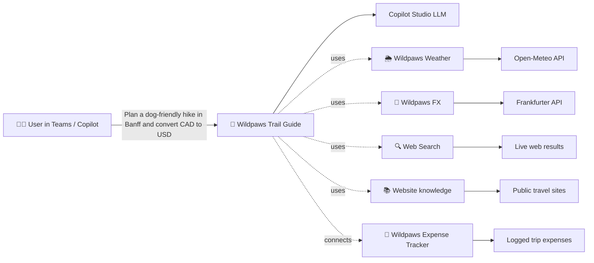

# 🐾 Wildpaws Expeditions — Copilot Studio Walkthrough

> Using this lab, you will learn how to create a Copilot Studio agent from end to end, including setting up and configuring tools that extend agent capabilities. You will explore how to connect multiple agents together to enable more advanced, orchestrated scenarios, and how to deploy agents so they can be shared and consumed across your organization. The lab also introduces key concepts such as Agent ID and Blueprints, helping you understand how agents are structured and managed at scale. From an AI Admin perspective, you will gain hands on experience applying governance and compliance templates, ensuring your agent aligns with organizational standards while confidently publishing it for broader enterprise use.

**What you'll build:** *Wildpaws Expeditions*, a fictional adventure-travel company for pet owners, gets:
- **Wildpaws Trail Guide**: main agent with travel knowledge, web search, two REST API tools, and a connected sub-agent
- **Wildpaws Expense Tracker**: connected sub-agent that logs trip expenses
- **Wildpaws Weather**: REST API tool (Open-Meteo, no auth)
- **Wildpaws FX**: REST API tool (Frankfurter, no auth)
- Published to **Microsoft Teams** so it appears in the **Agent 365 registry** with all tabs populated



**Estimated time:** 30–45 minutes.

**Prerequisites:**
- Tenant admin account (for Teams app approval)
- Copilot Studio free trial enabled for your user (or any Power Platform environment where you can create agents)
- Files from this folder: [`wildpaws-weather.yaml`](wildpaws-weather.yaml), [`wildpaws-fx.yaml`](wildpaws-fx.yaml), [`Wildpaws.png`](Wildpaws.png) (agent icon)

**Naming cheat-sheet:**

| Asset | Name |
|---|---|
| Main agent | `Wildpaws Trail Guide` |
| Connected sub-agent | `Wildpaws Expense Tracker` |
| Weather tool | `Wildpaws Weather` |
| Currency tool | `Wildpaws FX` |

---

## 📑 Index

- [Step 0: Sign in](#step-0-sign-in)
- [Step 1: Create the main agent (Wildpaws Trail Guide)](#step-1-create-the-main-agent-wildpaws-trail-guide)
- [Step 1b: Add a custom icon (avatar)](#step-1b-add-a-custom-icon-avatar)
- [Step 2: Add conversation starters](#step-2-add-conversation-starters)
- [Step 3: Configure knowledge & generative AI](#step-3-configure-knowledge--generative-ai)
- [Step 4: Add the Weather tool (Wildpaws Weather)](#step-4-add-the-weather-tool-wildpaws-weather)
- [Step 5: Add the Currency tool (Wildpaws FX)](#step-5-add-the-currency-tool-wildpaws-fx)
- [Step 6: Create the connected agent (Wildpaws Expense Tracker)](#step-6-create-the-connected-agent-wildpaws-expense-tracker-optional)
- [Step 7: Connect Expense Tracker to Trail Guide](#step-7-connect-expense-tracker-to-trail-guide-optional)
- [Step 8: Publish to Microsoft Teams](#step-8-publish-to-microsoft-teams-optional)
- [Step 9: Verify the Agent 365 registry](#step-9-verify-the-agent-365-registry)
- [Demo script: prompts that exercise EVERY tool, knowledge source, and connected agent](#demo-script-prompts-that-exercise-every-tool-knowledge-source-and-connected-agent)
- [Appendix: OpenAPI specs (reference)](#appendix-openapi-specs-reference)
- [What you accomplished](#what-you-accomplished)
- [Troubleshooting](#troubleshooting)

---

## Step 0: Sign in

1. Open **https://copilotstudio.microsoft.com**.
2. Sign in as your tenant admin.
3. If prompted, accept the **Copilot Studio free trial** (60 days, no credit card).
4. Top-right environment picker → confirm you're in the right environment. If you will use Pay-As-You-Go with an Azure Subscription, this environment must be **Production**.

---

## Step 1: Create the main agent (Wildpaws Trail Guide)

1. Left nav → **Agents**.
2. Top-right → click **+ Create blank agent** *(skips the conversational wizard)*.
3. Fill in:

   **Name**
   ```
   Wildpaws Trail Guide
   ```

   **Description**
   ```
   Your AI expedition planner from Wildpaws Expeditions — trip ideas, weather, currency conversion, and trail-side expense tracking for adventures with your furry crew.
   ```

   **Instructions** (paste the entire block)
   ```
   You are the Wildpaws Trail Guide, the friendly AI concierge for Wildpaws Expeditions — an adventure-travel company specializing in trips for pet owners and their pets.

   Your responsibilities:
   - Help travelers plan expeditions: destinations, weather, packing, pet-friendly logistics
   - Convert currencies for trip budgeting
   - Suggest trails, lodges, and activities suitable for both humans and pets
   - Hand off expense-tracking questions to the Wildpaws Expense Tracker agent
   - Use web search for current trail conditions, pet entry requirements, and travel advisories

   Style:
   - Warm, adventurous, lightly playful — drop the occasional 🐾 emoji
   - Always confirm departure city, destination, and which pet(s) are coming
   - When showing prices, include the user's home currency conversion
   - End suggestions with one follow-up question to keep the conversation moving

   Never invent flight prices, vaccine rules, hotel availability, or border requirements — always remind the user to verify with an official source or their vet.
   ```

4. Click **Create**. Wait for the green **"Your agent has been provisioned"** banner.

You land on the **Overview** tab with:
- **Details** card (Name + Description, with an Edit button)
- **Agent status (preview)**: may show "1 Warning" (safe to ignore until publish)
- **Select your agent's model**: default `Claude Sonnet 4.6` is fine
- **Instructions** card with your pasted block
- Right side: **Test your agent** chat panel

---

## Step 1b: Add a custom icon (avatar)

The icon shows up in: the Test panel bubble, the Teams app tile, the message author avatar, and the Agent 365 registry card. Skip and you get a generic gray circle with the agent's initials.

### 1b.1: Studio icon

1. Top-right **Settings (gear)** → left rail **Details** (also labeled **General** in some tenants).
2. Scroll to the **Icon** card → click **Change icon** (or the pencil on the current circle avatar).
3. Upload [`Wildpaws.png`](Wildpaws.png) from this folder. (It's a square paw-print logo, ready to drop in.)
   - If you want to bring your own: **PNG or SVG**, **square** (1:1, ≥ 192×192 px), **transparent background**, **< 1 MB**. Non-square images get center-cropped.
4. Pick a brand color for the fallback background (e.g. teal `#0B7A75` for Wildpaws).
5. **Save**.

> The ready-to-use icon ships with this guide at [`C:\wildpaws-travel-concierge\Wildpaws.png`](Wildpaws.png).

Want a different one? Quick sources:
- https://www.flaticon.com (search "paw print", free for personal use)
- https://www.iconscout.com (free with attribution)
- DALL-E / Image Creator: `"flat minimalist paw print logo, teal background, square 512x512, transparent edges, vector style"`

**What you accomplished:**

- Became familiar with Copilot Studio.
- Created a Copilot Studio agent by following Power User best practices within the organization.
- Practiced creating and sharing agents across the organization.
- Saved and published the agent.
- Validated the setup in the Entra Admin Center under Agents, including:
  - Agent Blueprint
  - Agent Identity with your name listed as the sponsor
- Established a reusable demo that you can leverage with your customers.

---

## Step 2: Add conversation starters

1. **Overview** → scroll to **Suggested prompts** → **+ Add** (or Edit).
2. Add these four:

   | Title | Prompt |
   |---|---|
   | Weekend in Banff with my dog | Plan a 2-day Banff trip for me and my golden retriever, including weather and a budget in EUR. |
   | Tokyo trip with my pup | I'm taking my small dog to Tokyo for 5 days. What should I pack and how much is ¥50,000 in USD? |
   | Quick currency check | How much is 250 GBP in INR right now? |
   | Track my trail expenses | Hand me off to the Expense Tracker so I can log today's adventure costs. |

3. **Save**.

---

## Step 3: Configure knowledge & generative AI

In current Copilot Studio, "general knowledge" and "web search" are split:
- **Settings → Generative AI** = orchestration toggle
- **Knowledge tab** = data sources (websites, files, etc.)

### 3a. Verify Generative AI orchestration

1. Top-right → **Settings** (gear icon) → left rail **Generative AI**.
2. Confirm **Use generative AI orchestration for your agent's responses?** = **Yes – Responses will be dynamic, using available tools and knowledge as appropriate.**
3. Scroll to **Connected agents** → confirm **Let other agents connect to and use this one** = **On**.
4. Leave Deep reasoning / Enhanced task completion **Off**.
5. Close Settings.

### 3b. Add public-website knowledge sources

1. Top tabs → **Knowledge** → **+ Add knowledge** → **Public websites**.
2. Add at least one (more is better):

   | Name | URL |
   |---|---|
   | Lonely Planet | https://www.lonelyplanet.com |
   | Pet travel rules (USDA APHIS) | https://www.aphis.usda.gov/aphis/pet-travel |
   | Trail conditions (AllTrails) | https://www.alltrails.com |

3. **Add** → **Save**. Each site shows **Ready** once indexed (~30 s).

### 3c. Enable Web Search

On the **Overview** tab, find the **Web Search** card and toggle it **Enabled**. *(This is the "search all public websites" capability, different from indexing specific sites in 3b.)*

**What you accomplished:**

- Set up the steps required to add another agent and establish agent-to-agent communication.
- Configured the foundation for multi-agent collaboration scenarios.
- Added knowledge bases to enhance the agent's capabilities and responses.
- Enabled these knowledge sources to be available in Agent 365, showcasing integration scenarios.

---

## Step 4: Add the Weather tool (Wildpaws Weather)

Spec file: [`wildpaws-weather.yaml`](wildpaws-weather.yaml) (Open-Meteo, free, no key).

### 4.1 Publish the tool definition

1. **Tools** → **+ Add a tool**.
2. Click the **REST API** filter pill.
3. Search returns "No results" → click **Create the REST API you need**.
4. The **Upload REST API specification** wizard opens. Left rail:
   `Upload spec → API plugin details → Authentication → Select Tools → Configure tool → Select tool parameters → Review → Publish`

5. **Upload spec**: drag `wildpaws-weather.yaml` → **Next**.

6. **API plugin details**:
   - Name: `Wildpaws Weather`
   - Description: `Free public weather forecast API (Open-Meteo) for trail planning. Use to get temperature, wind, and conditions for any latitude/longitude.`
   - **Next**.

7. **Authentication**: **No authentication** → **Next**.

8. **Select Tools**: click the auto-detected **Get weather forecast for a location** (`getForecast`) → **Next**.

9. **Configure tool**:
   - Display name: default (`Get weather forecast for a location`)
   - Description for the model:
     ```
     Use whenever the user asks about weather, temperature, rain, snow, or trail conditions. Geocode the city/location to lat/lon first.
     ```
   - **Next**.

10. **Select tool parameters**:
    - Inputs pre-fill from YAML descriptions, leave as-is.
    - Fill **Output description** (required ★):
      ```
      JSON object with current weather (temperature, wind, weather code) and a daily forecast for the requested location.
      ```
    - **Next**.

11. **Review** → **Next** → **Publish**. Wait for green check.

### 4.2 Attach the tool to the agent

1. **Tools** → **+ Add a tool** → **REST API** filter.
2. Click the **Wildpaws Weather** card.
3. Detail pane shows **Connection: Not connected**.
4. Click **Not connected** → **Create new connection** → **Create** (instant, no auth).
5. Once **Connected** → click **Add to agent** (bottom of pane).
6. Tool appears on the **Tools** tab with a green check.

**What you accomplished:**

- Added a tool to your agent, the Weather Tool.
- Enhanced the agent's capabilities by enabling real-time data access through tools.
- Demonstrated tool integration within Agent 365 scenarios.
- Enabled visibility into agent activity, with logs beginning to surface in Microsoft Defender.

---

## Step 5: Add the Currency tool (Wildpaws FX)

Spec file: [`wildpaws-fx.yaml`](wildpaws-fx.yaml) (Frankfurter / ECB, free, no key).

Repeat the §4.1 + §4.2 flow with these values:

- **Upload spec**: `wildpaws-fx.yaml`
- **API plugin details**:
  - Name: `Wildpaws FX`
  - Description: `Free public FX rates (Frankfurter / European Central Bank). Convert any amount between major currencies.`
- **Authentication**: No authentication
- **Select Tools**: `Convert one currency to another at the latest rate` (`getLatestRate`)
- **Configure tool**, Description for the model:
  ```
  Use whenever the user mentions converting money, exchange rates, or asks "how much is X in Y currency".
  ```
- **Select tool parameters**, Output description:
  ```
  JSON object with the converted amount, base currency, target currency, and the rate used.
  ```
- **Review** → **Publish** → wait for green check.
- **Attach**: Tools → +Add → REST API → Wildpaws FX → Create connection → Add to agent.

**What you accomplished:**

- Added an additional tool to your agent for currency exchange.
- Continued enriching the agent to align with advanced, power user-level capabilities.
- Expanded the agent's functionality to support multi-use, real-world scenarios.
- Demonstrated richer integration capabilities within Agent 365.

---

## Step 6: Create the connected agent (Wildpaws Expense Tracker) *(Optional)*

> **Note:** Publishing agents requires an **additional license**. The free Copilot Studio trial lets you build and test agents in the test panel, but an eligible license (Microsoft 365 Copilot, or a standalone Copilot Studio tenant + user license) is required to publish.

1. Far-left rail → **Agents** (back to the agent list, outside the current agent).
2. Top-right → **+ Create blank agent**.
3. Fill in:

   **Name**: `Wildpaws Expense Tracker`

   **Description**: `Logs and categorizes trail-side expenses for Wildpaws Expeditions travelers.`

   **Instructions**:
   ```
   You are the Wildpaws Expense Tracker — a focused assistant that helps adventurers log expenses from their Wildpaws expeditions.

   When invoked:
   1. Ask for: date, vendor, amount, currency, and category (meals / transport / lodging / pet-care / gear / other)
   2. Confirm the parsed entry back to the user
   3. Reply with a one-line summary like: "✅ Logged: 2026-05-11 · Banff Pet Lodge · $180.00 CAD · pet-care"
   4. Offer to log another or hand back to the Trail Guide

   Be terse — no fluff. Use checkmarks 🐾 and bullet points.
   ```

4. **Create**. Wait for provisioning.
5. **Enable connectability**: top-right **Settings** → **Generative AI** → scroll to **Connected agents** → toggle **Let other agents connect to and use this one** = **On**.
6. *(Optional)* Settings → **Connected Agents** → leave the input/output schema empty. Trail Guide will pass free text.
7. Close Settings → top-right **Publish** → **Publish**. Wait for green check.

**What you accomplished:**

- Created an additional agent that will be connected to the overall solution.
- Enabled the foundation for agent-to-agent communication scenarios.
- Expanded the multi-agent architecture to support more advanced workflows.
- Continued enriching the Agent 365 experience by enhancing the available tabs and integrations.

---

## Step 7: Connect Expense Tracker to Trail Guide *(Optional)*

> **Note:** Publishing agents requires an **additional license**. The free Copilot Studio trial lets you build and test agents in the test panel, but an eligible license (Microsoft 365 Copilot, or a standalone Copilot Studio tenant + user license) is required to publish.

1. Far-left rail → **Agents** → click **Wildpaws Trail Guide**.
2. Top tabs → click **Agents** *(inside an agent, this tab is the "Connected agents" list)*.
3. Click **+ Add an agent** → pick **Wildpaws Expense Tracker**.
4. **Description / when to invoke**:
   ```
   Hand off when the user wants to log, record, categorize, or review trip expenses or receipts.
   ```
5. **Add** / **Save**.
6. Top-right → **Publish** → **Publish** (republishes Trail Guide with the connected sub-agent).

---

## Step 8: Publish to Microsoft Teams *(Optional)*

> **Note:** Publishing agents requires an **additional license**. The free Copilot Studio trial lets you build and test agents in the test panel, but an eligible license (Microsoft 365 Copilot, or a standalone Copilot Studio tenant + user license) is required to publish.

1. On **Wildpaws Trail Guide** → top tabs → **Channels**.
2. Click the **Microsoft Teams and Microsoft 365 Copilot** card → **Add channel** → toggle **On**.
3. **Availability options** → **Make available to your org** → **Submit for admin approval**.

**What you accomplished:**

- Connected the agents and defined when each one should be invoked.
- Established clear orchestration across agents to support coordinated workflows.
- Completed a full end-to-end solution with agent-to-agent communication.
- Prepared a solution that is ready to be shared across your organization or with peers.

---

## Step 9: Verify the Agent 365 registry

> **Note:** The registry tabs (Overview, Instructions, Capabilities, Actions, Connected agents, Channels) can take up to **30 minutes** to fully populate after publishing. The **Activity** tab usually populates within a minute or so once you start sending prompts.

1. Open **https://admin.cloud.microsoft** → **Agents** → **All agents** (Registry tab).
2. You should see:
   - **Wildpaws Trail Guide**: Copilot Studio (the agent itself), **Available**
   - **Wildpaws Trail Guide**: no Platform tag (the Teams channel registration), **Available**
   - **Wildpaws Expense Tracker**: Copilot Studio, **Available**
3. Click the **Copilot Studio** Trail Guide row → verify all tabs populate:
   - **Overview**: name, description, owner
   - **Instructions**: your full prompt block
   - **Capabilities / Knowledge**: Web Search, Lonely Planet, AllTrails, USDA APHIS
   - **Actions / Tools**: Wildpaws Weather, Wildpaws FX
   - **Connected agents**: Wildpaws Expense Tracker
   - **Channels**: Teams
4. In the **Overview** tab, look for **Request**, select the agent, and you now have the option to publish the agent to the rest of the organization by selecting a **Template** or creating one from scratch directly in Agent 365.

Done. This is the full Agent Registry experience **without a Microsoft 365 Copilot license**.

### Step 9 closing remarks

**What you accomplished:**

- Completed a full end-to-end solution with an agent that includes multiple tools.
- Connected the agent to another agent, enabling agent-to-agent communication.
- Shared the solution across the organization, following Power User best practices.
- Acted as an AI Admin by approving the agent and applying the required organizational templates to ensure compliance.
- Applied identity and access controls, including conditional access policies, demonstrating the role of an Identity Admin.
- Prepared the solution for monitoring and observability by triggering prompts.
- Enabled activity tracking in Agent 365, populating the Activity tab.
- Verified sign-in logs in Entra for the agent identity `Wildpaws Trail Guide`.

> Note: Logs in Entra Admin Center may take up to 10 minutes to appear.

🎉 Congratulations, you just built a full demo that you can reuse with your customers.

---

## Demo script: prompts that exercise EVERY tool, knowledge source, and connected agent

Run these in the in-studio **Test your agent** panel or in the published Teams app. Each section below is designed so the orchestrator picks a specific capability. Watch the **Activity** map or the inline source/tool chips to confirm.

### Capability to prompt cheat-sheet

| # | Capability under test | Demo prompt |
|---|---|---|
| 1 | **Wildpaws Weather** tool (`getForecast`) | "What's the weather in Banff this weekend?" |
| 2 | **Wildpaws Weather**, multi-day | "Give me a 7-day weather forecast for Reykjavik." |
| 3 | **Wildpaws Weather**, wind / trail focus | "Will it be too windy to hike Mount Tamalpais this Saturday morning?" |
| 4 | **Wildpaws FX** tool (`getLatestRate`) | "How much is 250 GBP in INR right now?" |
| 5 | **Wildpaws FX**, reverse pair | "Convert 1,200 CAD to JPY." |
| 6 | **Wildpaws FX**, short form | "What's the dollar worth in euros today?" |
| 7 | **Knowledge: Lonely Planet** | "Top 3 things to do in Kyoto for a first-time visitor with a small dog?" |
| 8 | **Knowledge: AllTrails (Trail conditions)** | "Best dog-friendly trails near Boulder, Colorado?" |
| 9 | **Knowledge: USDA APHIS (Pet travel rules)** | "What are the dog vaccine and paperwork requirements to fly from the US to Mexico?" |
| 10 | **Web Search (Bing)** | "What's the current travel advisory for Egypt this week?" |
| 11 | **Web Search**, fresh news | "Are there any wildfire warnings in Banff National Park right now?" |
| 12 | **Connected agent: Expense Tracker**, single item | "I just paid 180 CAD at Banff Pet Lodge today, log it." |
| 13 | **Connected agent**, non-USD currency | "Track my expense: ¥4,500 for sushi in Tokyo today, meals category." |
| 14 | **Connected agent**, multi-receipt session | "Hand me off to the expense logger so I can record three receipts in a row." |
| 15 | **Multi-tool chain (Weather + FX)** | "I'm flying to Tokyo for 5 days with my small dog. Weather forecast and how much is ¥50,000 in USD?" |
| 16 | **Multi-tool chain (Weather + FX)** | "Plan a 2-day Banff trip for me and my golden retriever, including weather and a budget in EUR." |
| 17 | **Multi-tool comparison** | "Compare weather in Lisbon vs Barcelona next weekend, and convert 500 EUR into each local currency." |
| 18 | **Weather + Knowledge** | "What's the weather in Kyoto next Tuesday, and what are the top dog-friendly things to do there?" |
| 19 | **FX + Knowledge** | "How much is 100 GBP in MXN, and what paperwork do I need to bring my dog into Mexico?" |
| 20 | **All four capabilities in one prompt** | See **Big finale** below. |

### Big finale: everything in one prompt

> *"I'm planning a 4-day trip from Seattle to Lisbon next week with my border collie. Tell me the weather, what to pack, dog entry rules into Portugal, convert my $2,500 budget into EUR, and after that I want to log a $420 United Airlines ticket I just bought."*

Expected orchestration:
1. **Wildpaws Weather**: Lisbon, 4-day forecast
2. **USDA APHIS / Web Search**: dog import rules into Portugal
3. **Wildpaws FX**: USD 2,500 to EUR
4. Packing list grounded in weather + Lonely Planet
5. Hand off to **Wildpaws Expense Tracker** to log the United ticket

### Conversation-starter shortcuts

The 4 suggested prompts from Step 2 are pre-loaded on the agent's welcome screen. Click any of them to demo without typing:
- **Weekend in Banff with my dog**: fires Weather + FX
- **Tokyo trip with my pup**: fires Weather + FX + Knowledge
- **Quick currency check**: fires FX only
- **Track my trail expenses**: fires connected agent handoff

### Where to watch the orchestration

While the agent runs:
- **In Copilot Studio Test panel**: source/tool chips appear under each assistant message. Click them to see the actual API call payload.
- **Activity tab** inside the agent: live tool-call traces.
- **Agent 365 registry** → https://admin.cloud.microsoft → Agents → Wildpaws Trail Guide → **Activity** tab: enterprise-wide observability of every tool invocation.

---

## Appendix: OpenAPI specs (reference)

### wildpaws-weather.yaml

```yaml
openapi: 3.0.1
info:
  title: Wildpaws Weather
  description: Free trail weather forecast (Open-Meteo), no authentication.
  version: 1.0.0
servers:
  - url: https://api.open-meteo.com
paths:
  /v1/forecast:
    get:
      operationId: getForecast
      summary: Get weather forecast for a location
      description: Returns weather forecast for a given latitude/longitude.
      parameters:
        - name: latitude
          in: query
          required: true
          description: Latitude of the location, e.g. 47.6
          schema: { type: number }
        - name: longitude
          in: query
          required: true
          description: Longitude of the location, e.g. -122.3
          schema: { type: number }
        - name: current
          in: query
          required: false
          description: Comma-separated list of current weather variables.
          schema: { type: string, default: temperature_2m,wind_speed_10m,weather_code }
        - name: forecast_days
          in: query
          required: false
          description: Number of forecast days (1-16).
          schema: { type: integer, default: 3 }
      responses:
        '200':
          description: Forecast data
```

### wildpaws-fx.yaml

```yaml
openapi: 3.0.1
info:
  title: Wildpaws FX
  description: Free FX rates from the European Central Bank (Frankfurter), no authentication.
  version: 1.0.0
servers:
  - url: https://api.frankfurter.dev
paths:
  /v1/latest:
    get:
      operationId: getLatestRate
      summary: Convert one currency to another at the latest rate
      description: Returns the latest exchange rate from a base currency to one or more target currencies.
      parameters:
        - name: amount
          in: query
          required: true
          description: Amount of money to convert, e.g. 100.
          schema: { type: number }
        - name: base
          in: query
          required: true
          description: ISO-4217 base currency code, e.g. USD, EUR, GBP.
          schema: { type: string }
        - name: symbols
          in: query
          required: true
          description: ISO-4217 target currency code, e.g. EUR, INR, JPY. One symbol per call.
          schema: { type: string }
      responses:
        '200':
          description: Conversion result
```

---

## What you accomplished

- Built a Copilot Studio agent with custom instructions, conversation starters, web search, and three website knowledge sources
- Created two REST API tools from OpenAPI specs (no Power Apps custom connector dance needed)
- Created a second agent and wired it as a connected sub-agent
- Published both to Teams and confirmed all Agent 365 registry tabs populate
- All without a Microsoft 365 Copilot license. Copilot Studio's free trial alone

To rebuild from scratch in a different tenant, follow Steps 0 to 9 in order using the YAML specs in this folder. Total time: 30–45 min.

---

## Troubleshooting

### Active users show a scrambled User principal name instead of a real email

When you open **https://admin.cloud.microsoft** → **Agents** → **All agents** → select an agent → **Active users**, the **User principal name** column may show an opaque, scrambled value instead of the real user email, for example:

```
6NMH17jEj6OiqzZNOPMkuYVmqGl6/tCxtbiQqpyh1r13VW
```

**Why this happens:** Microsoft 365 *pseudonymizes* (conceals) user, group, and site names in admin reports by default in many tenants. The Agent 365 registry's usage data inherits the same privacy setting, so real identities are replaced with a hashed token. This is a tenant-wide reporting privacy control — it is not specific to agents.

**How to show the real user email:**

> Requires the **Global Administrator** role. The change is tenant-wide and affects all Microsoft 365 admin reports (Usage, Copilot, Agents, etc.).

1. Sign in to the **Microsoft 365 admin center**: **https://admin.cloud.microsoft** (or **https://admin.microsoft.com**).
2. In the left nav, go to **Settings** → **Org settings**.
3. On the **Services** tab, select **Reports**.
4. **Uncheck** the box labeled **"Display concealed user, group, and site names in all reports."**
5. Click **Save**.
6. Return to **Agents** → **All agents** → your agent → **Active users**. New activity now resolves to real user principal names (real email addresses).

**Notes:**
- The setting takes effect going forward; allow a short period (and a page refresh) for the report to repopulate. Activity reports can take **up to 48 hours** to fully reflect the change.
- To re-enable privacy later, repeat the steps and **re-check** the box.
- If the **Reports** option or the checkbox is greyed out, confirm your account holds the **Global Administrator** role — other admin roles cannot change this setting.
